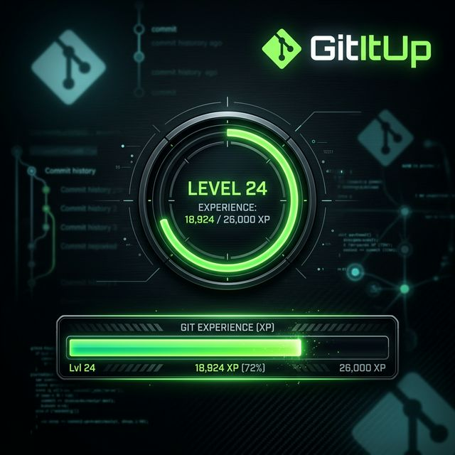

# 🎮 GitItUp — Git Gamification (v0.0.1)



A lightweight desktop overlay that gamifies your coding workflow. Every Git commit earns you XP and levels you up!

---

## ✨ Features

- **🔄 Shapes & Layouts** — Choose from a minimalist circular ring or a classic horizontal bar.
- **🎨 Visual Theme Picker** — Select from 10 premium color gradients using a rectangular visual selector.
- **🎚️ Transparency Control** — Adjust the default idle opacity with a slider directly in the settings.
- **📍 Multi-Positioning** — Snap to any screen corner or edge via the tray menu.
- **Git Integration** — Automatically gains XP on every successful `git commit`.
- **🕹️ Leveling System** — XP requirements increase with each level (×1.5 scaling).
- **Persistent Progress** — Your level, XP, and layout settings are saved between sessions.
- **👁️ Hover Reveal** — Translucent by default, fully visible and clickable on mouse hover.
- **📥 System Tray** — Control the app, change layouts, and manage visibility from the tray.

---

## 🚀 Setup

### 1. Install Dependencies
Open a terminal in the `App` folder and run:
```bash
npm install
```

### 2. Install the App (Shortcut)
Run the installer to create a desktop shortcut with the official icon and silent startup:
```powershell
.\instalar.bat
```

### 3. Install the Global Git Hook
Run the hook installer to enable XP tracking for **all** your Git repositories:
```powershell
.\install-hook.bat
```

### 4. Start the App
Simply double-click the **GitItUp** icon on your Desktop.
(Or launch via `npm start` in the terminal).

---

## ⚙️ Configuration

Edit the constants in `main.js` and `index.html` to customize the progression speed.

| Constant | Default | Description |
|---|---|---|
| `BASE_XP` | `100` | XP needed for level 1 → 2 |
| `XP_PER_COMMIT` | `25` | XP earned per commit |
| `GROWTH_FACTOR` | `1.5` | XP multiplier per level |

### Current Level Curve:
| Level | XP Required |
|---|---|
| 1 → 2 | 100 |
| 2 → 3 | 150 |
| 3 → 4 | 225 |
| 4 → 5 | 338 |

---

## 🔧 Technical Overview

1.  **Main Process**: Electrons `main.js` runs a tiny HTTP server on `localhost:31415`.
2.  **Notification Hub**: The global Git hook sends a `POST /commit` signal after every commit.
3.  **UI Updates**: The app receives the signal, appends XP, triggers a CSS animation, and saves data to `xp-data.json`.
4.  **Local API**:
    - `POST /commit`: Add 25 XP.
    - `GET /status`: View current level, total commits, and current XP.

---

## 📁 Project Structure

```text
XPBar_Release/
├── README.md           # Instructions
├── instalar.bat        # Desktop shortcut installer (One-click)
├── install-hook.bat    # Global Git hook installer
└── App/                # Internal application files
    ├── main.js         # Electron main 
    ├── index.html      # UI and XP logic
    ├── style.css       # Styling & animations
    ├── icon.png        # App & Tray icon
    ├── assets/
    │   └── icon.ico    # Shortcut icon
    ├── hooks/
    │   └── post-commit # The Git hook script
    └── package.json    # Dependencies
```

---

## ⚖️ License

Distributed under the ISC License. See `LICENSE` for more information.
